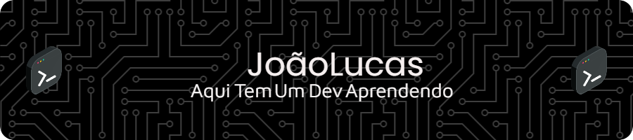

### 🖖 Olá, me Chamo João Lucas, Seja Bem Vindo(a)

#### 🔭 Trilhando e Estudando as tecnologias Front-End Web Development !
 
 💻 Atualmente Trabalhando na Area de Pricing no Ramo Varejista (Dalben Supermercados) de Campinas SP, focado em Dados e Estrategia, usando também grandes Tecnologias como SQL para montagem e extração de Dados, Excel para Organizar os dados, e Python para RPA trazendo produtividade em tarefas repetitivas e claro sempre em busca de novos conhecimentos.
  
  

 💻 Estas são as ferramentas usadas em meu Dia a Dia
   
 

 
 

### 💻 Social 
 

 
 

### 💻 Tecnologias e  Ferramentas 🛠️
 

 
 
 

 
 
 

 

 
 

## 💻 Repositório das Minhas Artes 😅
 

* <a href="https://github.com/jlmsdev?tab=repositories" target="_blank">
    Repositório JLMSDEV 💻✌️👩‍💻
</a>

 
 
 

Visitantes ⚙️👩‍💻

